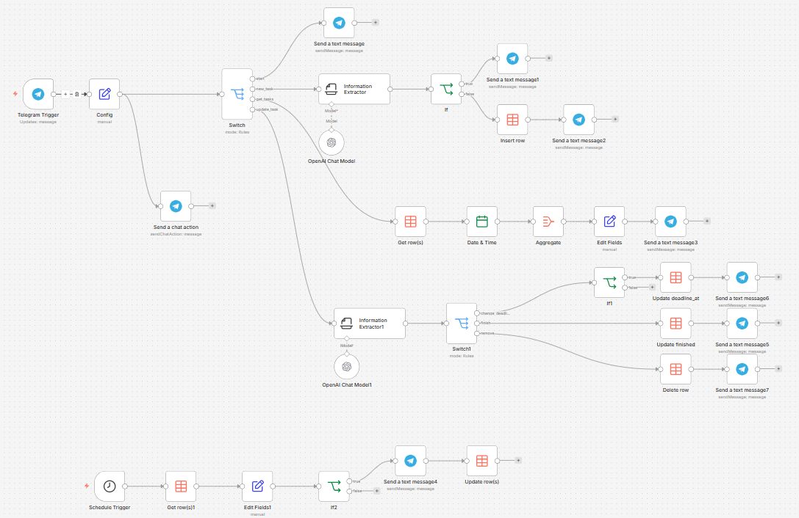

# Telegram Task Manager на базе n8n

[English version](./README.md)

Telegram-бот для управления задачами на базе n8n, Telegram Bot API и OpenAI.
Workflow позволяет создавать задачи из естественного языка, извлекать дедлайны, хранить задачи в Data Table, изменять их и отправлять напоминания за 30 минут до дедлайна.

## Обзор

Это n8n workflow для Telegram-бота, который поддерживает четыре основные команды: `/start`, `/newtask`, `/list` и `/updatetask`.
В проекте есть отдельные ветки для маршрутизации команд, создания задач, обновления задач и планировщика напоминаний.



## Возможности

- Создание задач из сообщений на естественном языке
- Извлечение дедлайна из явных и относительных формулировок
- Проверка дедлайна перед сохранением задачи
- Просмотр списка активных задач в Telegram
- Перенос дедлайна, завершение или удаление задачи
- Автоматические напоминания за 30 минут до дедлайна
- Хранение задач в n8n Data Table

## Примеры команд

```text
/newtask Позвонить начальнику цеха завтра в 19:30
/list
/updatetask TASK-12 перенеси на пятницу 11:00
/updatetask TASK-12 выполнено
/updatetask TASK-12 удалить
```

## Список команд

| Команда | Назначение | Результат |
|---|---|---|
| `/start` | Запуск бота | Отправляет приветствие и список команд |
| `/newtask` | Создание новой задачи | Извлекает текст задачи и дедлайн, затем сохраняет задачу |
| `/list` | Показ активных задач | Возвращает текущий список задач пользователя |
| `/updatetask` | Изменение существующей задачи | Обновляет дедлайн, завершает или удаляет задачу |

## Архитектура

### 1. Вход и маршрутизация
- **Telegram Trigger** принимает входящие сообщения.
- **Config** извлекает `command`, `message_content` и `chat_id`.
- **Switch** направляет выполнение по нужной ветке команды.

### 2. Создание задачи
- **Information Extractor** извлекает `task_content` и `deadline_at`.
- **If** проверяет корректность дедлайна.
- **Insert row** сохраняет задачу в Data Table `Tasks`.
- Telegram-узел отправляет сообщение об успехе или ошибке валидации.

### 3. Получение списка задач
- **Get row(s)** загружает активные задачи для текущего `chat_id`.
- **Date & Time**, **Aggregate** и **Edit Fields** формируют удобное сообщение.
- Telegram-узел отправляет пользователю список задач.

### 4. Обновление задачи
- Второй **Information Extractor** извлекает `task_id`, `action` и при необходимости новый `deadline_at`.
- **Switch1** направляет действие на перенос дедлайна, завершение или удаление.
- Узлы Data Table обновляют или удаляют нужную запись.

### 5. Напоминания
- **Schedule Trigger** запускается каждую минуту.
- **Get row(s)1** загружает незавершённые и ещё не уведомлённые задачи.
- **Edit Fields1** вычисляет, пора ли отправлять напоминание.
- Telegram-узел отправляет напоминание, после чего **Update row(s)** обновляет состояние записи.

## Модель данных

Workflow использует Data Table с именем `Tasks`.

| Поле | Тип | Описание |
|---|---|---|
| `chat_id` | number | ID чата Telegram |
| `TaskContent` | string | Текст задачи пользователя |
| `DeadlineAt` | dateTime | Дедлайн задачи |
| `Finished` | boolean | Флаг завершения |
| `notified` | boolean | Флаг отправки напоминания |

## Дополнительные файлы

- [Примеры команд (EN)](./examples/telegram-commands.md)
- [Примеры команд (RU)](./examples/telegram-commands-ru.md)
- [Промпт для extractor-узла создания задачи (RU)](./prompts/create-task-extractor.txt)
- [Промпт для extractor-узла создания задачи (EN)](./prompts/create-task-extractor-en.txt)
- [Промпт для extractor-узла обновления задачи (RU)](./prompts/update-task-extractor.txt)
- [Промпт для extractor-узла обновления задачи (EN)](./prompts/update-task-extractor-en.txt)

## Структура проекта

```text
telegram-task-manager-n8n/
├─ README.md
├─ README_RU.md
├─ LICENSE
├─ .gitignore
├─ docs/
│  ├─ workflow-schema-original.jpg
│  └─ screenshots/
├─ workflows/
│  └─ telegram-task-manager.json
├─ prompts/
│  ├─ create-task-extractor.txt
│  ├─ create-task-extractor-en.txt
│  ├─ update-task-extractor.txt
│  └─ update-task-extractor-en.txt
└─ examples/
   ├─ telegram-commands.md
   └─ telegram-commands-ru.md
```

## Быстрый старт

1. Установите и запустите n8n.
2. Создайте Telegram-бота через [@BotFather](https://t.me/BotFather).
3. Добавьте Telegram credentials в n8n.
4. Добавьте OpenAI credentials в n8n.
5. Создайте Data Table `Tasks` с нужными полями.
6. Импортируйте `workflows/telegram-task-manager.json` в n8n.
7. Переподключите все Telegram- и OpenAI-узлы к своим credentials.
8. Обновите все узлы Data Table, чтобы они ссылались на вашу таблицу `Tasks`.
9. Активируйте workflow.

## Детали настройки

### Telegram
- Создайте токен бота через BotFather.
- Добавьте токен в credential `Telegram account` в n8n.
- Убедитесь, что workflow активирован, чтобы webhook Telegram работал корректно.

### OpenAI
- Создайте OpenAI API key.
- Добавьте его в credential `OpenAI account` в n8n.
- Проверьте, что нужные модели доступны в вашем окружении.

### Data Table
Создайте Data Table `Tasks` со следующими колонками:

```text
chat_id      number
TaskContent  string
DeadlineAt   dateTime
Finished     boolean
notified     boolean
```

## Чек-лист перед запуском

Перед активацией workflow проверьте:

- Telegram credentials переподключены
- OpenAI credentials переподключены
- Все узлы Data Table используют вашу таблицу `Tasks`
- Интервал `Schedule Trigger` подходит под ваш сценарий
- Бот отвечает на `/start`
- Создание задачи работает на тестовом сообщении, например `/newtask Сдать отчёт завтра в 18:00`

## Устранение проблем

### Задачи не сохраняются
- Проверьте настройки узла `Insert row`.
- Убедитесь, что схема Data Table `Tasks` создана правильно.
- Проверьте, что `deadline_at` корректно извлекается в extractor-узле.

### Бот не отвечает
- Проверьте Telegram credentials.
- Убедитесь, что workflow активирован.
- Проверьте, зарегистрирован ли webhook у `Telegram Trigger`.

### Напоминания не приходят
- Проверьте состояние `Schedule Trigger`.
- Убедитесь, что у тестовых задач `Finished = false` и `notified = false`.
- Проверьте, что логика сравнения дедлайна использует правильный часовой пояс.

## Безопасность

- Не публикуйте реальные API-ключи и токены Telegram.
- Не коммитьте production chat ID и персональные данные.
- Перед загрузкой на GitHub экспортируйте workflow без секретов.

## Примечания

- В проекте используются OpenAI extractor-узлы как для создания задач, так и для их обновления.
- Напоминания реализованы отдельной веткой по расписанию.
- После импорта workflow нужно перенастроить идентификаторы, зависящие от окружения.
